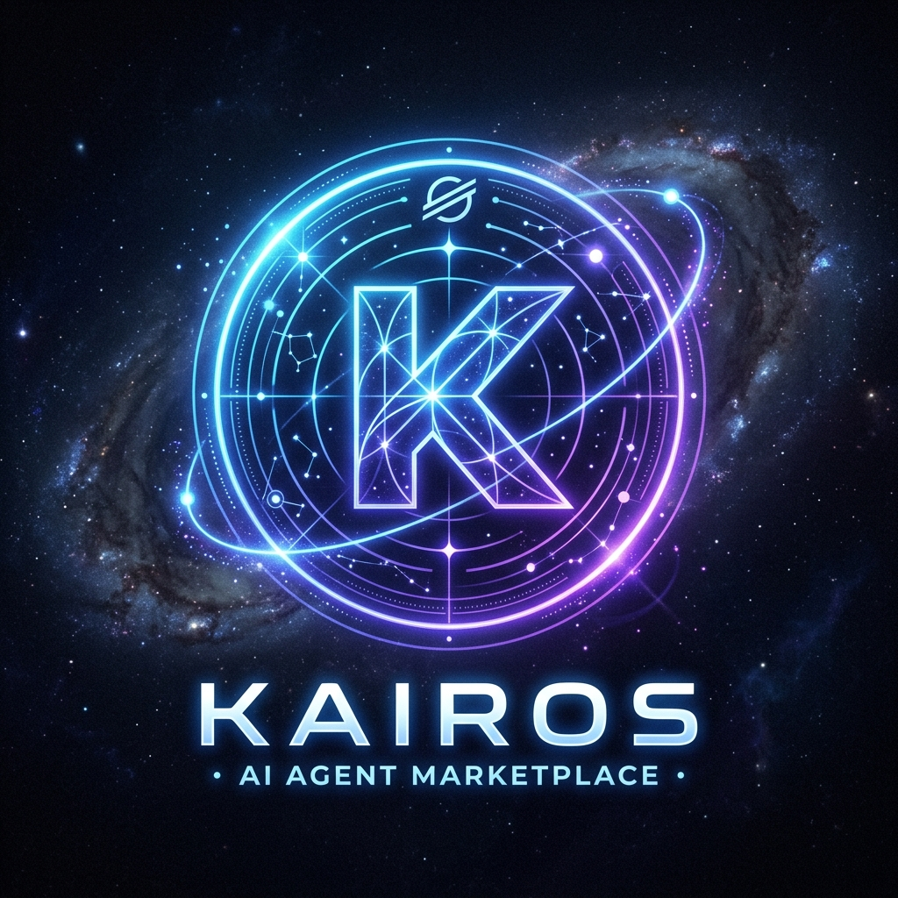

# Kairos

Kairos is a multi-agent intelligence platform for crypto markets built on Stellar rails.

It orchestrates specialized AI agents (price, news, yields, tokenomics, perps, Stellar analytics), settles paid interactions on Stellar, and returns verifiable transaction receipts to the application layer.

<div align="center">
  
</div>

## Live References

- Backend (Railway): `https://kairos-chatbox.up.railway.app`
- Soroban Agent Registry (testnet): `CBLVIPCOGFNDLBGZ6ZQ2S3NPSA2CU3H6EZZJXYKBKHLTQ2MKJWPRQZG5`

## Key Capabilities

- Multi-agent orchestration with parallel tool execution.
- On-chain settlement receipts for agent tasks (`x402Transactions` map).
- Soroban-backed service discovery and pricing for agent metadata.
- Wallet-based trustline setup and testnet funding UX.
- Paid endpoint flow for x402-style API interactions.

## Repository Layout

- `kairos-backend/` — Node.js + TypeScript orchestration API.
- `kairos-frontend/` — React + Vite client app.
- `contracts/agent-registry/` — Soroban smart contract for agent metadata.

## Architecture Overview

1. Client sends query to `POST /query`.
2. Backend orchestrator routes work across specialist agents.
3. Settlement transaction is submitted on Stellar per paid work item.
4. API response returns content + settlement receipts.
5. Frontend renders receipts with explorer-proof links.

## On-Chain Components

### Soroban Agent Registry

The contract stores:

- owner address
- service type
- task price
- reputation and task counters

Current deployed contract (testnet):

- `CBLVIPCOGFNDLBGZ6ZQ2S3NPSA2CU3H6EZZJXYKBKHLTQ2MKJWPRQZG5`

Quick verification:

```bash
stellar contract invoke --network testnet --source kairos --id CBLVIPCOGFNDLBGZ6ZQ2S3NPSA2CU3H6EZZJXYKBKHLTQ2MKJWPRQZG5 -- get_agents_by_service --service_type price
stellar contract invoke --network testnet --source kairos --id CBLVIPCOGFNDLBGZ6ZQ2S3NPSA2CU3H6EZZJXYKBKHLTQ2MKJWPRQZG5 -- get_agents_by_service --service_type news
stellar contract invoke --network testnet --source kairos --id CBLVIPCOGFNDLBGZ6ZQ2S3NPSA2CU3H6EZZJXYKBKHLTQ2MKJWPRQZG5 -- get_agents_by_service --service_type stellar
```

### USDC Asset Model

Kairos uses the Stellar asset model `USDC:<issuer>`.

- Default testnet path uses treasury-issued USDC for reliability.
- You can switch to another issuer (for example Circle on supported networks) by setting `USDC_ISSUER_ADDRESS` and ensuring trustlines + token availability for treasury and agent wallets.

## API Surface

### Core

- `GET /health`
- `POST /query`

### Stellar Utilities

- `POST /api/stellar/sponsor`
- `GET /api/stellar/balance/:address`
- `POST /api/stellar/usdc/trustline-xdr`
- `POST /api/stellar/submit-xdr`
- `POST /api/stellar/usdc/faucet`

### Paid Endpoint Flow

- `GET /api/x402/health`
- `GET|POST /api/x402/*`

Flow: call -> payment required -> pay -> retry with tx hash.

## Local Development

### Prerequisites

- Node.js 20+
- npm
- Freighter (or compatible Stellar wallet)
- Stellar testnet treasury secret

### Install

```bash
cd kairos-backend && npm install
cd ../kairos-frontend && npm install
```

### Backend Environment (`kairos-backend/.env`)

Required:

- `GEMINI_API_KEY`
- `STELLAR_SPONSOR_SECRET`
- `STELLAR_NETWORK` (`testnet` or `public`)
- `USDC_ISSUER_ADDRESS`
- `AGENT_REGISTRY_CONTRACT_ID`

Recommended:

- `ALLOWED_ORIGINS`
- `SUPABASE_URL`
- `SUPABASE_ANON_KEY`
- `COINGECKO_API_KEY`

Optional addresses:

- `ORACLE_X402_ADDRESS`
- `NEWS_X402_ADDRESS`
- `YIELD_X402_ADDRESS`
- `TOKENOMICS_X402_ADDRESS`
- `PERP_STATS_X402_ADDRESS`
- `STELLAR_SCOUT_X402_ADDRESS`

### RAG (optional)

When enabled, the backend builds a **hybrid index**: local `rag-corpus/*.md` **plus** HTTPS pages listed in **`rag-corpus/sources.urls`** (one URL per line) and/or **`KAIROS_RAG_URLS`** (comma-separated). Those URLs are fetched at index time (docs, arXiv abstract pages, etc.), converted to plain text, chunked, and embedded with Gemini **`gemini-embedding-001`** (override with `KAIROS_RAG_EMBED_MODEL`). Retrieved chunks include the **canonical URL** when the hit came from the web so answers can cite real sources. Only **https** origins are allowed (basic SSRF protection). Tune fetch with `KAIROS_RAG_FETCH_TIMEOUT_MS`, `KAIROS_RAG_FETCH_MAX_BYTES`, `KAIROS_RAG_FETCH_GAP_MS`. Live market data still comes from tools. Disable RAG with `KAIROS_RAG=0`. **`KAIROS_RAG_STRICT=1` (default)** runs RAG only when the user message looks like a **Kairos / x402 / deployment / docs** question (so generic Stellar or market questions do not always surface the same web docs). Set **`KAIROS_RAG_STRICT=0`** to always attempt vector retrieval. Other knobs: `KAIROS_RAG_MIN_SCORE` (default `0.32`), `KAIROS_RAG_TOP_K` (default `24`, max ranked chunks scanned before **deduping by URL / file**), `KAIROS_RAG_MAX_CHUNKS`, `KAIROS_RAG_BUDGET_MS`, `KAIROS_RAG_FILES`, `KAIROS_RAG_DIR`.

### Frontend Environment (`kairos-frontend/.env`)

- `VITE_API_URL` (for example `http://localhost:3001` for local)
- `VITE_ADMIN_ADDRESS` (optional)

### Run

```bash
cd kairos-backend && npm run dev
cd kairos-frontend && npm run dev
```

## Deployment

### Backend (Railway)

- Set service root to `kairos-backend`.
- Use provided `Dockerfile` and `railway.toml`.
- Configure required backend variables.
- Verify:

```bash
curl https://<your-backend-domain>/health
```

### Frontend

- Deploy independently (Vercel, Netlify, or Railway static).
- Set `VITE_API_URL=https://<your-backend-domain>`.

## One-Time: Register Agents On-Chain

```bash
cd kairos-backend
export AGENT_REGISTRY_CONTRACT_ID="CBLVIPCOGFNDLBGZ6ZQ2S3NPSA2CU3H6EZZJXYKBKHLTQ2MKJWPRQZG5"
# Each agent signs its own registration (testnet only)

export ORACLE_AGENT_SECRET="S..."
export NEWS_AGENT_SECRET="S..."
export YIELD_AGENT_SECRET="S..."
export TOKENOMICS_AGENT_SECRET="S..."
export PERP_AGENT_SECRET="S..."
export STELLAR_SCOUT_AGENT_SECRET="S..."
npm run registry:register
```

## Verification Checklist

1. `GET /health` returns `status: ok`.
2. Registry queries return IDs by service type.
3. Wallet can add trustline and receive testnet USDC.
4. Query flow returns receipts (`x402Transactions`).
5. Explorer links resolve to real testnet transactions.
6. Paid endpoint flow succeeds with tx hash.

## Known Constraints

- Some market intelligence is API-backed (not on-chain data).
- Testnet asset behavior depends on issuer + trustline setup.
- Testnet reliability can vary during RPC/Horizon congestion.

## License

MIT
